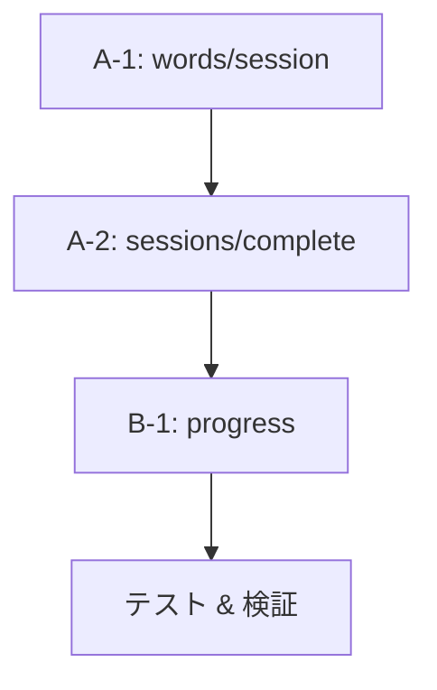

# API統合 Phase 6 - 全体管理ドキュメント

**目的**: 新型定義と新セッション構築ロジックをAPI層に統合
**開始日**: 2025-11-20
**前提条件**: Phase 1-5完了、Phase 7完了（型定義リファクタリング）

---

## 📊 進捗サマリー

| カテゴリ | 完了 | 進行中 | 未着手 | 合計 |
|---------|------|--------|--------|------|
| **新ロジック適用** | 0 | 0 | 2 | 2 |
| **削除フィールド対応** | 0 | 0 | 9 | 9 |
| **認証系（影響小）** | 0 | 0 | 2 | 2 |
| **バッチ処理** | 0 | 0 | 2 | 2 |
| **合計** | **0** | **0** | **15** | **15** |

**全体進捗**: 0% (0/15)

---

## 🎯 対象API一覧

### カテゴリA: 新ロジック適用（最優先）

セッション構築の新アルゴリズムを適用

| # | API | ステータス | 優先度 | エラー数 | 詳細ドキュメント |
|---|-----|----------|--------|----------|-----------------|
| A-1 | `/api/words/session` | ⏳ 未着手 | 🔴 最高 | 3 | [words-session-migration.md](./api/words-session-migration.md) |
| A-2 | `/api/sessions/complete` | ⏳ 未着手 | 🔴 最高 | 1 | TBD |

**A-1の概要**:
- 旧関数削除: `getOptimalSessionComposition()`, `selectOptimalWords()`
- 新関数適用: `selectRandomPattern()`, `buildSession()`
- パフォーマンス: O(n log n) → O(1)

**A-2の概要**:
- 既に`calculateRecommendedReviewDate()`使用中（部分完了）
- インポート元修正のみ必要

---

### カテゴリB: 削除フィールド対応（高優先）

削除済みDBフィールドへの参照を修正

| # | API | ステータス | 優先度 | 主な問題 | エラー数 |
|---|-----|----------|--------|----------|----------|
| B-1 | `/api/progress` | ⏳ 未着手 | 🟠 高 | WordExample参照、旧SM-2フィールド | 7 |
| B-2 | `/api/words` | ⏳ 未着手 | 🟠 高 | difficulty, frequency, examples参照 | 4 |
| B-3 | `/api/dashboard` | ⏳ 未着手 | 🟠 高 | wordsStudied, dailyGoal, User統計 | 6 |
| B-4 | `/api/progress/analytics` | ⏳ 未着手 | 🟡 中 | wordsStudied, User統計フィールド | 7 |
| B-5 | `/api/progress/daily` | ⏳ 未着手 | 🟡 中 | wordsStudied, dailyGoal | 5 |
| B-6 | `/api/progress/learning-history` | ⏳ 未着手 | 🟡 中 | wordsStudied | 2 |
| B-7 | `/api/sessions/history` | ⏳ 未着手 | 🟡 中 | wordsStudied | 1 |
| B-8 | `/api/user/profile` | ⏳ 未着手 | 🟡 中 | User.name（削除済み） | 2 |
| B-9 | `/api/auth/register` | ⏳ 未着手 | 🟢 低 | User.name（削除済み） | 2 |

**削除済みフィールド一覧**:

| フィールド | 削除元テーブル | 理由 | 影響API数 |
|-----------|---------------|------|----------|
| `wordsStudied` | LearningSession | 冗長（WordProgressから計算可） | 6 |
| `name` | User | 未使用 | 3 |
| `dailyGoal` | User | 未使用 | 3 |
| `currentStreak` | User | 計算可能 | 2 |
| `longestStreak` | User | 計算可能 | 2 |
| `totalWordsLearned` | User | 計算可能 | 1 |
| `totalStudyTime` | User | 計算可能（バグあり） | 1 |
| `examples` | Word | WordExampleテーブル削除 | 3 |
| `difficulty` | Word | 未使用 | 1 |
| `frequency` | Word | 未使用 | 1 |
| `easeFactor` | WordProgress | SM-2削除 | 1 |
| `interval` | WordProgress | SM-2削除 | 1 |
| `repetitions` | WordProgress | SM-2削除 | 1 |
| `previousStatus` | WordProgress | 冗長 | 0 |

---

### カテゴリC: バッチ処理（中優先）

| # | API | ステータス | 優先度 | 備考 |
|---|-----|----------|--------|------|
| C-1 | `/api/progress/batch` | ⏳ 未着手 | 🟡 中 | 既存実装確認後に判断 |
| C-2 | `/api/progress/struggling-words` | ⏳ 未着手 | 🟡 中 | 既存実装確認後に判断 |

---

### カテゴリD: 認証系（影響小）

| # | API | ステータス | 優先度 | 備考 |
|---|-----|----------|--------|------|
| D-1 | `/api/auth/[...nextauth]` | ✅ OK | - | エラーなし |
| D-2 | `/api/user/change-password` | ✅ OK | - | エラーなし |

---

## 🔄 実装フロー

### フェーズ1: 基盤整備（完了）
- ✅ Phase 1-5: 新セッション構築ロジック実装（テスト62個全パス）
- ✅ Phase 7: 型定義リファクタリング

### フェーズ2: コアAPI統合（進行中）



**優先順位の理由**:
1. **A-1** - セッション構築の入り口（最重要）
2. **A-2** - セッション完了処理（最重要）
3. **B-1** - 進捗更新（コア機能）
4. **テスト** - 動作確認後に残りのAPI修正

### フェーズ3: 残りのAPI修正

B-2以降を順次修正（優先度順）

---

## 📝 各APIの詳細ドキュメント

| API | ドキュメント | ステータス |
|-----|------------|-----------|
| `/api/words/session` | [words-session-migration.md](./api/words-session-migration.md) | ✅ 作成済み |
| `/api/sessions/complete` | TBD | ⏳ 未作成 |
| `/api/progress` | TBD | ⏳ 未作成 |
| その他 | TBD | ⏳ 未作成 |

---

## ✅ チェックリスト

### 各API修正時の共通チェック項目

#### 1. コード修正
- [ ] 削除済みフィールドへの参照を削除
- [ ] 旧関数を新関数に置き換え
- [ ] 型定義を`@/types`または`@prisma/client`から正しくインポート
- [ ] エラーハンドリング確認

#### 2. 型チェック
```bash
npx tsc --noEmit
```
- [ ] 対象ファイルのTypeScriptエラーが0

#### 3. ユニットテスト
```bash
npm test
```
- [ ] 全テスト（62個）がパス

#### 4. 手動テスト
```bash
npm run dev
# ブラウザまたはcurlでAPIテスト
```
- [ ] APIレスポンスが正常
- [ ] データ構造が正しい
- [ ] エラーケースの動作確認

#### 5. コミット
```bash
git add <file>
git commit -m "[Phase 6-X] <変更内容>"
```
- [ ] 意味のある単位でコミット
- [ ] コミットメッセージが明確

---

## 🐛 既知の問題と対応

### 1. TypeScriptエラー75個

**現状**: Phase 7後、型定義変更により約75個のエラー

**内訳**:
- 削除フィールド参照: ~60個
- 削除関数参照: ~10個
- その他: ~5個

**対応**: Phase 6で順次修正

### 2. ユニットテストは全パス

**現状**: ビジネスロジック層（lib/）のテストは62個全てパス

**理由**: Phase 1-5でロジック層を完全にテスト駆動開発

**対応**: API層の統合後も継続的に確認

### 3. 削除予定の機能

以下の機能は廃止予定だが、暫定的に型エラーのみ修正：

- **Difficulty選択**: `easy/medium/hard`による単語選択（mastery statusベースに移行済み）
- **User統計フィールド**: `totalWordsLearned`, `currentStreak`等（計算可能）

---

## 📊 進捗トラッキング

### 完了基準

| マイルストーン | 条件 | 進捗 |
|--------------|------|------|
| **M1: コアAPI統合** | A-1, A-2完了 | 0/2 (0%) |
| **M2: 主要API修正** | B-1, B-2, B-3完了 | 0/3 (0%) |
| **M3: 統計API修正** | B-4, B-5, B-6, B-7完了 | 0/4 (0%) |
| **M4: 全API修正** | 全15API完了 | 0/15 (0%) |
| **M5: TypeScriptクリーン** | `tsc --noEmit`エラー0 | ❌ |
| **M6: テスト全パス** | 全テストパス | ✅ (62/62) |

### 更新履歴

| 日付 | 完了API | 累計進捗 | 備考 |
|------|--------|---------|------|
| 2025-11-20 | - | 0/15 (0%) | Phase 6開始、ドキュメント作成 |

---

## 🔗 関連ドキュメント

### Phase 1-5: セッション構築ロジック
- [session-construction-refactoring-v2.md](./session-construction-refactoring-v2.md)

### Phase 7: 型定義リファクタリング
- [type-system-refactoring.md](./type-system-refactoring.md)

### データ構造全体
- [data-architecture-improvements.md](./data-architecture-improvements.md)

### 個別API詳細
- [api/words-session-migration.md](./api/words-session-migration.md)

---

## �� 次のアクション

### 今すぐ開始すべきタスク

1. **A-1: `/api/words/session` 修正**
   - ドキュメント: ✅ 作成済み
   - 実装: ⏳ 未着手
   - 見積: ~30分

2. **A-2: `/api/sessions/complete` 修正**
   - ドキュメント: ⏳ 未作成
   - 実装: ⏳ 未着手
   - 見積: ~15分（インポート修正のみ）

### 今後のタスク

3. **B-1: `/api/progress` 修正** - WordExample削除、旧SM-2削除
4. **テスト & 検証** - A-1, A-2, B-1の動作確認
5. **残りのAPI修正** - B-2以降を順次実施

---

## 📞 サポート

### 質問・相談

- **実装方針**: 各API詳細ドキュメント参照
- **設計背景**: session-construction-refactoring-v2.md参照
- **トラブルシューティング**: 各API詳細ドキュメントのTroubleshooting参照

### 更新方法

このドキュメントは進捗に応じて更新：

```bash
# 進捗トラッキング表を更新
# 更新履歴に日付と完了APIを追記
git add docs/api-integration-phase6-overview.md
git commit -m "docs: Update Phase 6 progress"
```
